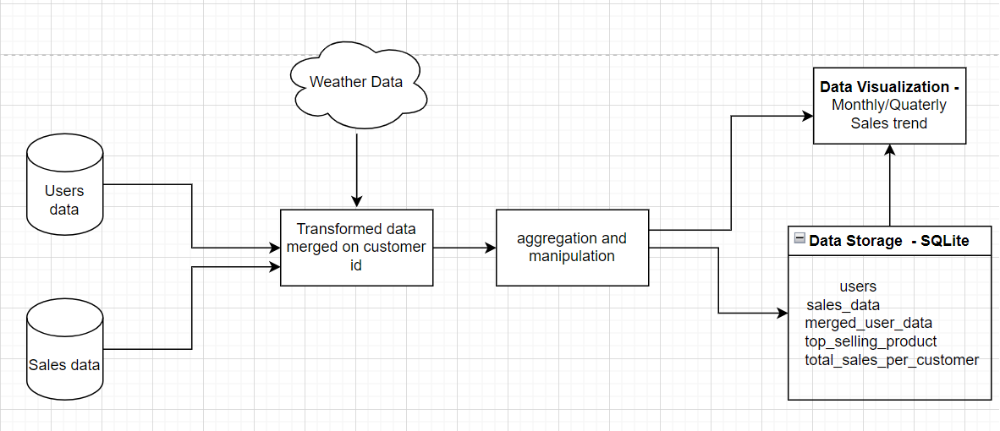
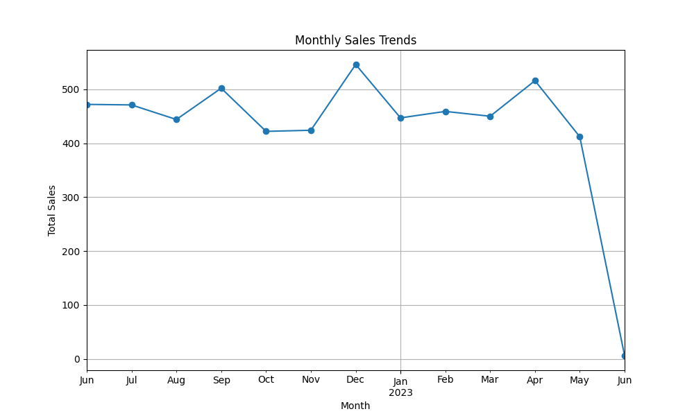
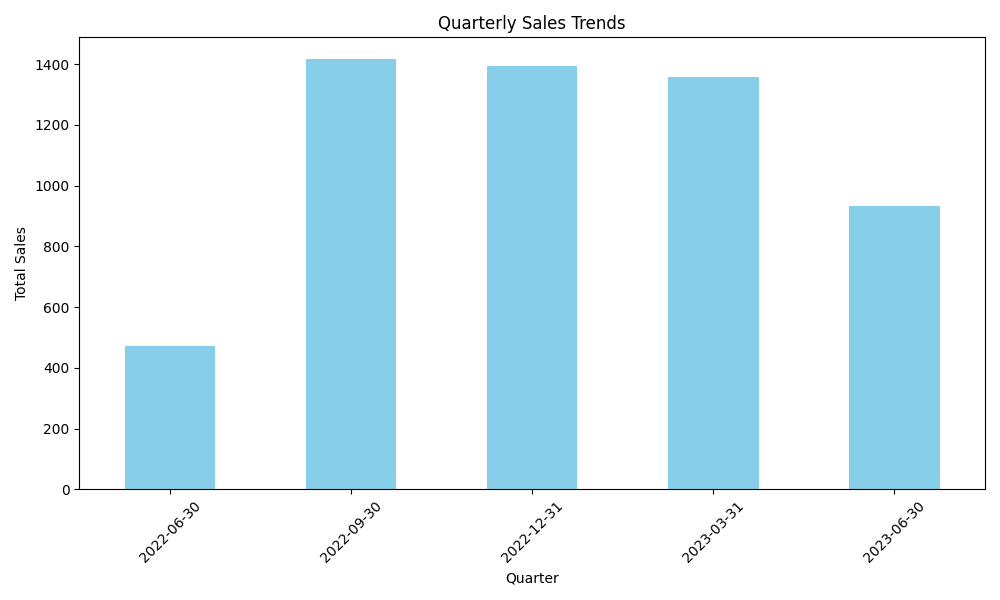

# data_pipeline

This data pipeline is designed to perform three main tasks: data transformation, data manipulation/aggregation, and data storage in SQLite database. This README provides setup and usage instructions to run the data pipeline effectively.

 ## Flow Diagram

 

## Pre-requisites
 1. Python3 - this project was built using Python 3.11.4
 2. Install the relevant libraries using the command - pip install -r requirements.txt

 ## Data Pipeline Steps
   1. Data Transformation - merge user data and sales data, extract weather related information (method/data_transformation.py)
   2. Data Manipulation/aggregation - performed manipulations and aggregations on the merged data(method/data_manipulation.py)
   3. Visualization - monthly and quaterly sales trend reports present in "/report" folder (method/data_manipulation.py)
   4. Data Storage - create and store aggregated data in RDBMS - SQLite (method/data_storage.py)
      Different table created in SQLite - users,sales_data,merged_user_data,top_selling_product,total_sales_per_customer
      These can be accessed using sales.db file that is created in the project folder.

## Running the code
 1. Clone this repo on your local and change to the project directory `cd data_pipeline`  
 2. Set the below enviroment parameters :-
    ```

              SET USER_DATA_URL = 'https://jsonplaceholder.typicode.com/users'
              SET API_KEY ='<API_KEY>'
              SET WEATHER_URL = 'https://api.openweathermap.org/data/2.5/weather'

    ```  
 3. Run command - python app.py 

 ## Data Visualization

### Monthly Sales Trends
 

### Quaterly Sales Trends
 
